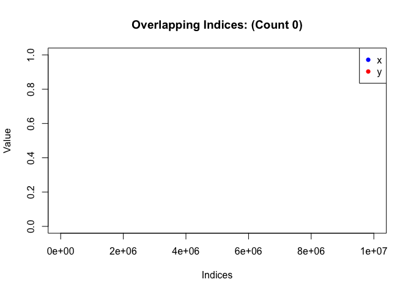

<!-- README.md is generated from README.Rmd. Please edit that file -->

# sparse

<!-- badges: start -->
<!-- badges: end -->

The sparse package provides the `sparse_numeric` class which is a
representation fo a sparse numeric vector. This class comes with
associated helper methods to do operations on these vectors such as
addition, multiplication, etc…

## Example

To construct a sparse vector, we can convert a dense vector to sparse
like so.

``` r
library(sparse)
#> 
#> Attaching package: 'sparse'
#> The following object is masked from 'package:base':
#> 
#>     norm

dense1 <- c(1, rep(0, 1e7))
dense2 <- c( rep(0, 1e7), 1)
sparse1 <- as(dense1, "sparse_numeric")
sparse2 <- as(dense2, "sparse_numeric")
```

Now with this sparse vector we can perform basic arithmetic operations
such as addition, multiplication, and subtraction.

``` r
sparse1 - sparse2
#> Sparse numeric vector of length 10000001 with 2 non-zero entries
#> Positions: 1 10000001 
#> Values:    1 -1
sparse1 + sparse2
#> Sparse numeric vector of length 10000001 with 2 non-zero entries
#> Positions: 1 10000001 
#> Values:    1 1
sparse1 * sparse2
#> Sparse numeric vector of length 10000001 with 0 non-zero entries
#> Positions:  
#> Values:
```

We also define other helpers such as the inner product, mean, and
standardization.

``` r
sparse_crossprod(sparse1, sparse2)
#> [1] 0
mean(sparse1)
#> [1] 9.999999e-08
s <- standardize(sparse1)
```

Finally we can print and visualize sparse vectors.

``` r
show(sparse1)
#> Sparse numeric vector of length 10000001 with 1 non-zero entries
#> Positions: 1 
#> Values:    1
plot(sparse1, sparse2)
```


